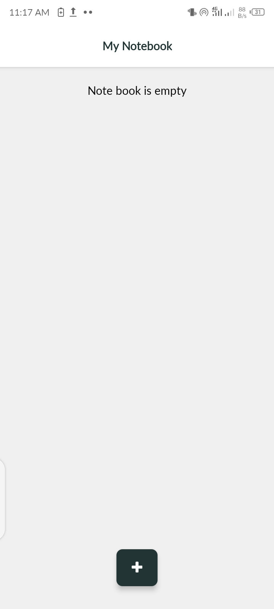

# My Notebook App

This is an [Expo](https://expo.dev) project created with [`create-expo-app`](https://www.npmjs.com/package/create-expo-app).
It is a simple app for taking notes on your mobile device (iOS and Android)
Tech Stack: React, Typescript, React Native, Expo

### Instructions on how to get started

1. Ensure you have set up your machine for React Native App development

2. Install dependencies

   ```bash
   npm install
   ```

3. Start the app

   ```bash
   npx expo start
   ```

In the output, you'll find options to open the app in a

- [development build](https://docs.expo.dev/develop/development-builds/introduction/)
- [Android emulator](https://docs.expo.dev/workflow/android-studio-emulator/)
- [iOS simulator](https://docs.expo.dev/workflow/ios-simulator/)
- [Expo Go](https://expo.dev/go), a limited sandbox for trying out app development with Expo

### Screenshots

    

#### You can request a preview build below, android only

[Get preview build](https://wa.me/+233543093942)
